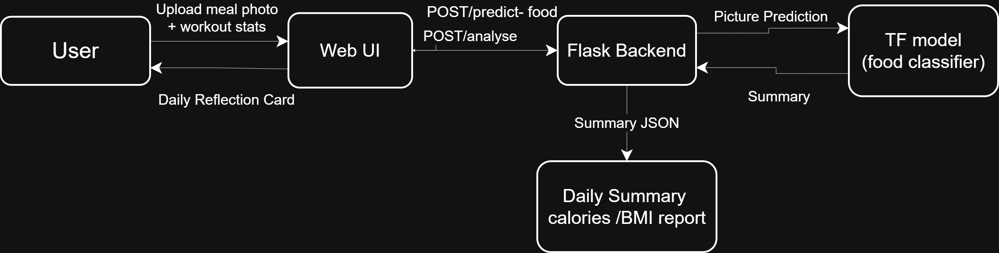
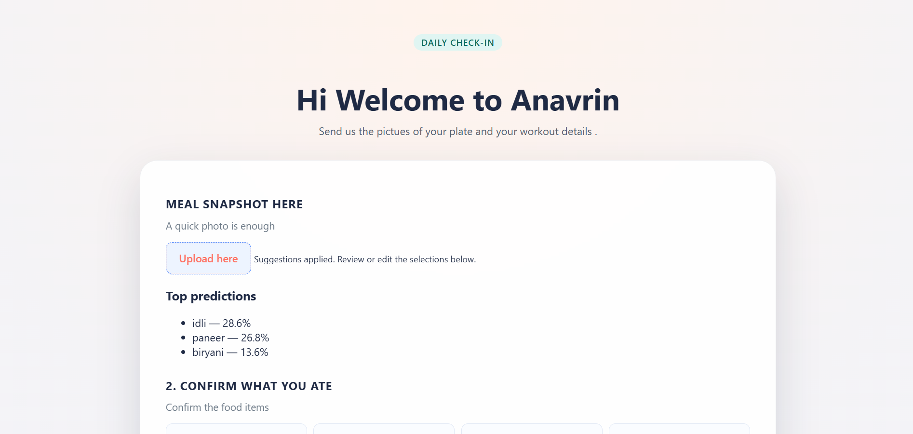
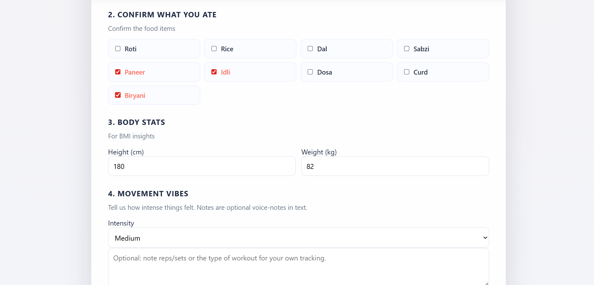

# Indian Food Ai Fitness Prototype

## Problem statement
Ai driven fitness and nutrition prototype, focused on indian food.

Most of the existing websites are:
-Subscription Based
-Do not understand indian food properly
-Use external APIs
-Track diet, workout and steps separately

Because of this user get inaccurate calorie counts and not so useful advices which doesn't lead to expected results

## Our plan
We are making a AI bases fitness and nutrition assistant specially for indian users.
Instead of looking at food, workout, or steps separately our system combines them and give a vivid picture of user's daily activity and based on this it estimate maintenance calories and suggest whether the user should bulk, cut or maintain.
Instead of asking user to manually enter the food items our system allows the user to manually upload a photo of their meal the information than combined with the workout deatils and step count to estimate maintenance calorie and suggest whether the user should bulk, cut or maintain weight.
The focus is mainly the indian food habits and make the system affordable, simple and relevent.

## Key features
-Calorie estimate for common Indian foods
-Consider workout intensity along with daily steps
-Estimate maintenance calories
-Simple user interface

## Working
1. The user enter the photo of the food they consumed
2. The user confirms the indian food items present in the meal 
3. The user provides the workout details and step count also the height and weight
4. The system calculate an estimate daily calorie requirement
5. The calorie bured thought workout and steps are calculated
6. Bases on the result, the system suggests:
   Maintenance plan
   Bulking plan
   Cutting plan

## Flowchart

   Start
     ↓
   Upload the image of your plate
     ↓
   Confirm food items
     ↓
   Enter User Details
     ↓
   Calorie Intake Calculation
     ↓
   Calories Burned Calculation
     ↓
   Maintenance Calorie Estimation
     ↓
   Fitness Goal Suggestion
     ↓
   End

## Data Flow Diagram

## Steps to run the prototype
1.Clone the repo
2.Ceate and activate a virtual environment
3.install the required packages
    py -3.11 -m venv .venv
    .\.venv\Scripts\activate
4. install tensorflow 
    pip install --upgrade pip
   pip install Flask tensorflow==2.17.0 numpy pillow
5. run the training script 
    python ml\food_classifier_training.py
6. run the app
    python app.py

## Tech Stack 
Frontend: HTML, CSS, JavaScript
Logic: Rule Based and Ai assisted calculations 
Data: Indian food calorie data
Backend: Python(Flash)

## Screenshots

## Screenrecording

https://drive.google.com/file/d/1avxUC6yXU5PKSeI3clyAO5GC3GFMO9Vl/view?usp=sharing 

## Future Scope 
1. Implement a machine learning based food recognition model for Indian food
2. User History and progess tracking enable user to view past records
3. Increase the food recognition and calorie estimation accuracy
4. Add a login page for user accounts
5.Implement personalised workout goals and plans

## Team members 
-Rahul Joshi
-Bhumi
-Shivani Negi
-Piyush Palariya

Note: 
The project is developed for Round 1 prototype . 
Larger files can be found in the gdrive link : https://drive.google.com/drive/folders/1awNis5qDmCYOIn1FVib9OLDbpXd23HzS?usp=sharing

